# 📱 UPHF Store

**UPHF Store**, est une application mobile de commerce en ligne développée avec **SwiftUI**. Cette application permet aux utilisateurs de naviguer parmi une liste de produits, de categories, rechercher un article spécifique, passer commande, consulter leurs achats et profiter d'offres promotionnelles. L'authentification est simplifiée grâce à **Apple ID** et les paiements sont gérés avec **Stripe**.

---

### 🎯 Fonctionnalités principales
- 🛒 **Consulter les produits** : Affichage dynamique des articles disponibles.
- 🔍 **Rechercher un produit** : Filtrer et rechercher un produit par nom.
- 🛍 **Commander un produit** : Ajouter un produit au panier et finaliser l’achat.
- 📦 **Suivi des commandes** : Accéder à l’historique et au statut des commandes.
- 🏷 **Offres promotionnelles** : Découvrir des réductions et promotions en cours.
- 🔐 **Connexion avec Apple ID** : Sécurisation et simplification de l’authentification.

### 🛠 Technologies utilisées
- **SwiftUI** : Interface utilisateur moderne et réactive.
- **Firebase** : Gestion de l’authentification et de la base de données.
- **Stripe** : Intégration des paiements en ligne.
- **Xcode** : Environnement de développement principal.
- **App architecture** : Model-View-ViewModel (MVVM).
---

## 📸 Aperçu de l’application
## Screenshots

|                      Screen 1                      |                      Screen 2                      |
|:--------------------------------------------------:|:--------------------------------------------------:|
| 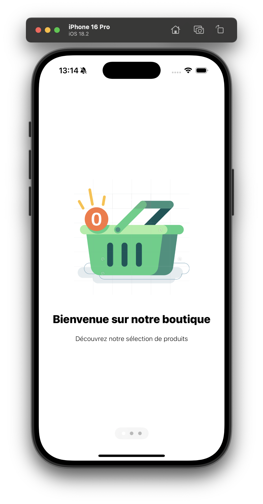 | 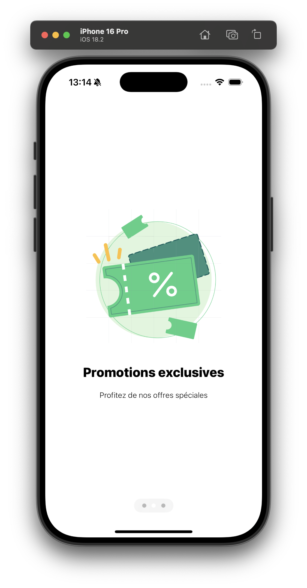 |

|                      Screen 3                      |                      Screen 4                      |
|:--------------------------------------------------:|:--------------------------------------------------:|
| 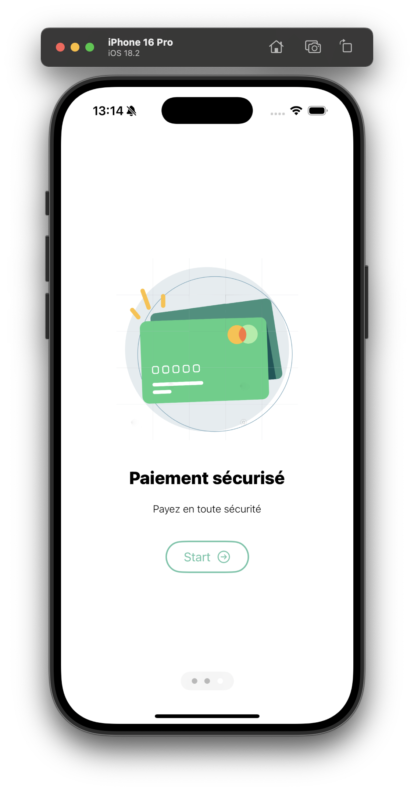 | 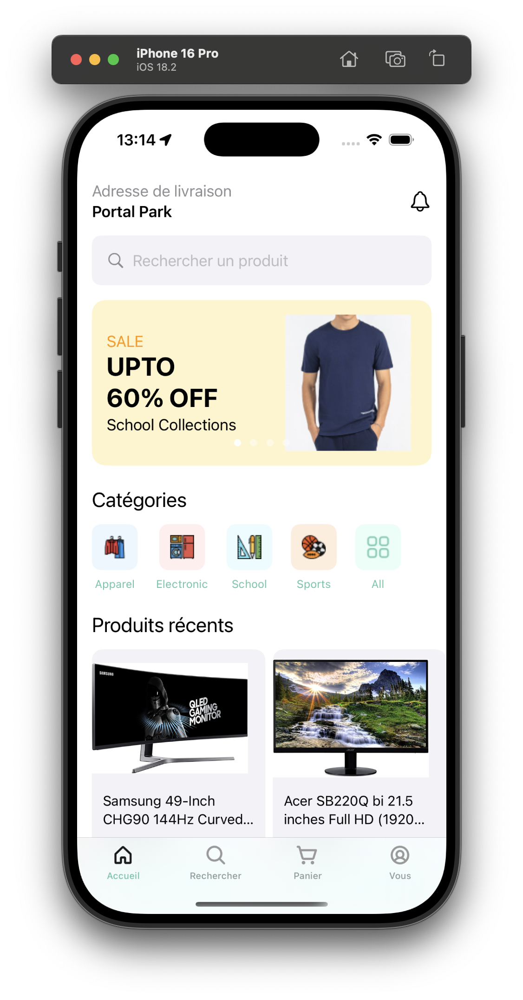 |

|                      Screen 5                      |                      Screen 6                      |
|:--------------------------------------------------:|:--------------------------------------------------:|
| 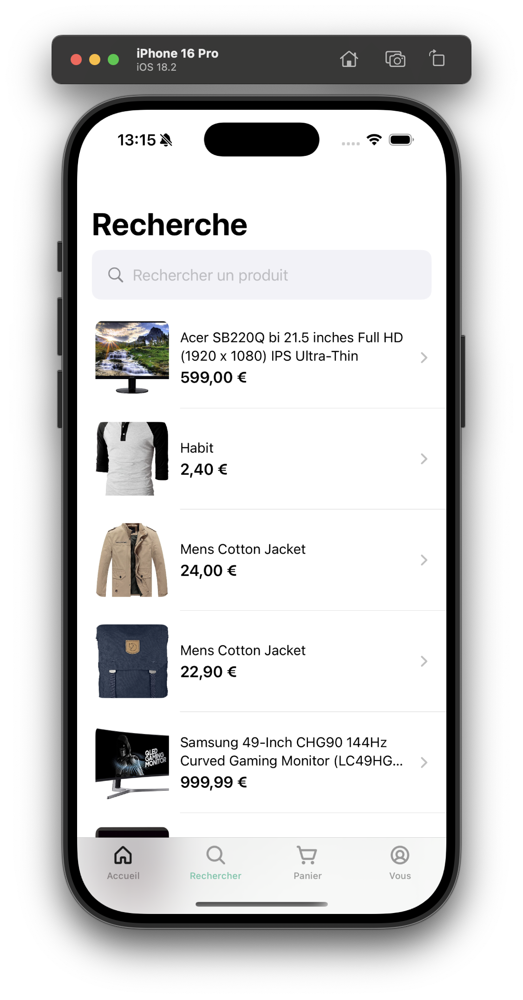 | 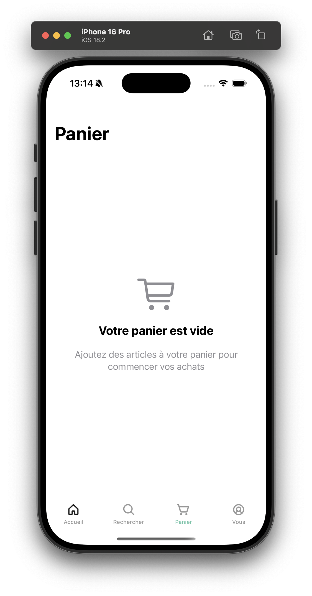 |

|                      Screen 7                      |                      Screen 8                      |
|:--------------------------------------------------:|:--------------------------------------------------:|
| 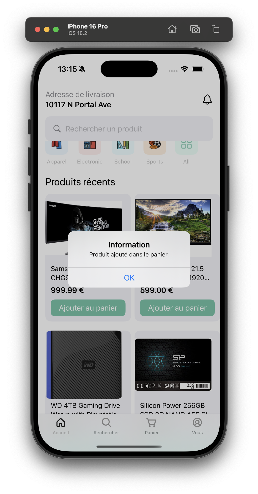 | 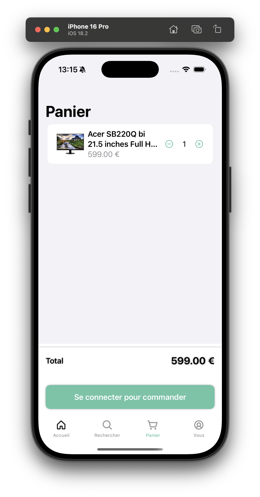 |

|                      Screen 9                      |                      Screen 10                      |
|:--------------------------------------------------:|:--------------------------------------------------:|
| 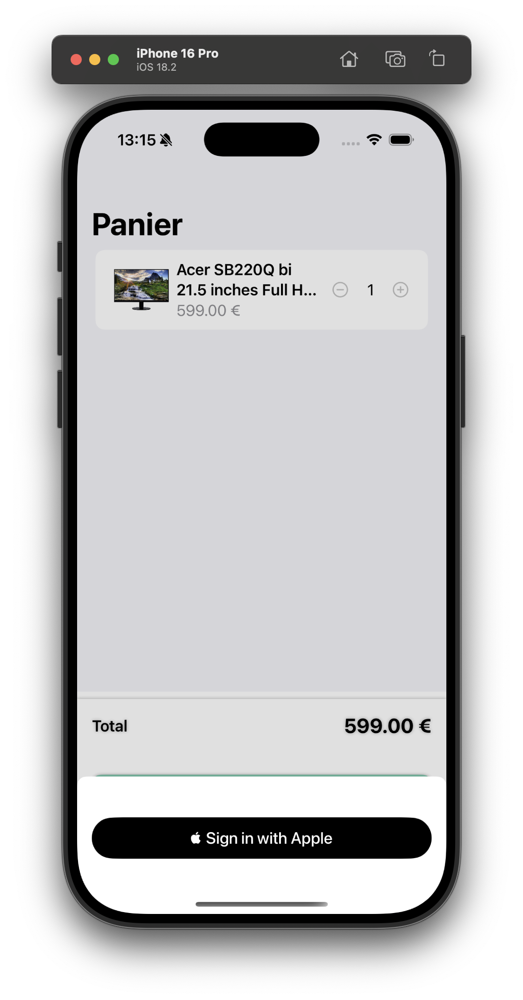 | 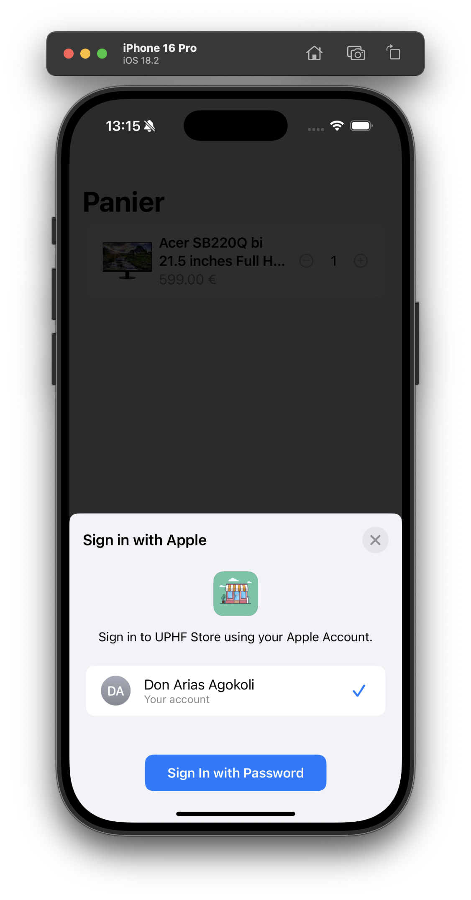 |


|                      Screen 11                      |                      Screen 12                      |
|:--------------------------------------------------:|:--------------------------------------------------:|
| 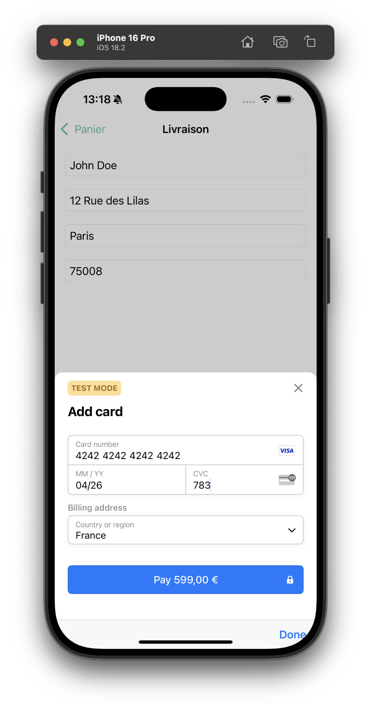 | 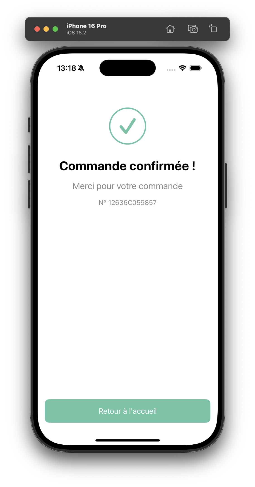 |


---

## 🔧 Installation

1. Clonez ce dépôt :
   ```bash
   git clone https://github.com/dongorias/uphf-store-app-mobile.git
   ```
2. Ouvrez le **Store.xcodeproj** avec **Xcode** et exécutez l’application sur un simulateur ou un appareil physique..

---
## 👨‍💻 Author
- **Don Arias Agokoli**  
[](https://twitter.com/don_gorias)
